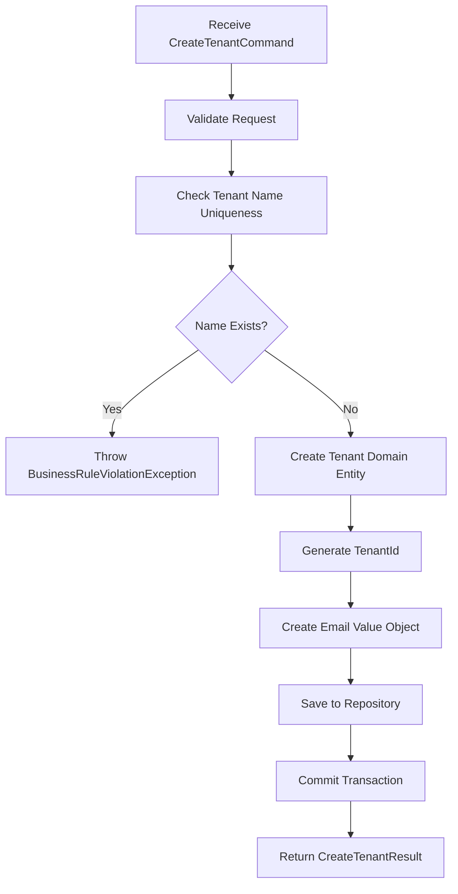

# Create Tenant Use Case

<div align="center">
  
</div>

> **Turn your specs into stacks**

## Overview

The **Create Tenant** use case handles the creation of new tenant organizations within the ReadyStackGo (RSGO) platform. This is a foundational operation that establishes the organizational boundaries for user management and system installations.

## Business Context

A **Tenant** represents an organizational unit (company, department, or team) that will manage their own installations and users within the ReadyStackGo platform. Each tenant operates in isolation from other tenants, providing multi-tenancy capabilities.

## Use Case Flow

### 1. Request Structure
```csharp
public class CreateTenantCommand : IRequest<CreateTenantResult>
{
    public string Name { get; set; } = default!;           // Required: Tenant name
    public string? Description { get; set; }               // Optional: Description
    public string ContactEmail { get; set; } = default!;   // Required: Contact email
}
```

### 2. Business Rules
- **Unique Tenant Name**: No two tenants can have the same name
- **Valid Email Format**: Contact email must be a valid email address
- **Name Required**: Tenant name cannot be null or empty
- **Email Validation**: Email is validated using .NET's `MailAddress` class

### 3. Process Flow



## Domain Design

### Value Objects Used
- **`Email`**: Ensures email format validation and provides immutability
- **`TenantId`**: Strongly-typed identifier preventing ID mixing

### Domain Events
The tenant creation process raises the following domain event:
- **`TenantCreatedEvent`**: Contains tenant ID, name, and contact email for downstream processing

### Aggregate Boundaries
The `Tenant` aggregate is responsible for:
- Managing its own identity and basic properties
- Validating business rules during creation
- Maintaining user invitations and tenant users (child entities)

## Implementation Details

### Handler Structure
```csharp
public class CreateTenantHandler : IRequestHandler<CreateTenantCommand, CreateTenantResult>
{
    private readonly ITenantRepository _tenantRepository;
    private readonly IUnitOfWork _unitOfWork;
    
    // Implementation handles validation, creation, and persistence
}
```

### Repository Operations
- **`ExistsAsync(name)`**: Checks for tenant name uniqueness
- **`AddAsync(tenant)`**: Persists the new tenant
- **`SaveChangesAsync()`**: Commits the transaction via Unit of Work

### Result Structure
```csharp
public class CreateTenantResult
{
    public TenantId TenantId { get; set; }     // Generated tenant ID
    public string Name { get; set; }           // Confirmed tenant name
    public string ContactEmail { get; set; }   // Confirmed contact email
    public DateTime CreatedAt { get; set; }    // Creation timestamp
}
```

## Error Handling

### Business Rule Violations
- **Duplicate Name**: `BusinessRuleViolationException` with message "Tenant with name '{name}' already exists"
- **Invalid Email**: `ArgumentException` from Email value object validation

### Technical Exceptions
- **Database Errors**: Handled by infrastructure layer
- **Validation Errors**: Handled by MediatR pipeline behaviors (if configured)

## Integration Points

### Domain Events
After successful creation, the system publishes:
```csharp
new TenantCreatedEvent(tenantId, tenantName, contactEmail)
```

This event can trigger:
- Welcome email sending
- Initial setup processes
- Audit logging
- External system notifications

### Dependencies
- **ITenantRepository**: Domain repository interface
- **IUnitOfWork**: Transaction management
- **MediatR**: Command/Query handling pattern

## Testing Considerations

### Unit Tests Should Cover
- ✅ Successful tenant creation
- ✅ Duplicate name validation
- ✅ Invalid email format handling
- ✅ Domain event publishing
- ✅ Repository interaction

### Integration Tests Should Cover
- ✅ End-to-end tenant creation flow
- ✅ Database persistence
- ✅ Transaction rollback on errors
- ✅ Event publishing to message bus

## Usage Example

```csharp
var command = new CreateTenantCommand
{
    Name = "Acme Corporation",
    Description = "Software development company",
    ContactEmail = "admin@acme.com"
};

var result = await mediator.Send(command);
// Result contains TenantId, Name, ContactEmail, CreatedAt
```

## Related Use Cases
- **Invite User to Tenant**: Uses the created tenant ID
- **Update Tenant Details**: Modifies existing tenant
- **Deactivate Tenant**: Soft-deletes tenant
- **List Tenants**: Queries available tenants

## Architecture Alignment

This use case follows our **business-first domain structure**:
- **Command/Handler**: Application layer coordination
- **Domain Model**: Business logic and validation
- **Repository**: Data access abstraction
- **Domain Events**: Decoupled integration

The implementation demonstrates proper **aggregate boundaries**, **value object usage**, and **domain event patterns** consistent with Domain-Driven Design principles.
