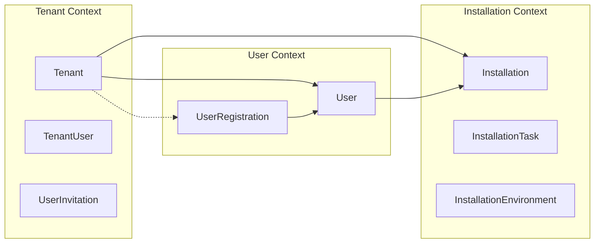

# SystemInstaller Domain Design

## Overview

This document outlines the domain design principles and patterns used in the SystemInstaller system. We follow Domain-Driven Design (DDD) principles with Clean Architecture patterns.

## Domain Structure

### Business-First Organization Principle

Our domain follows a **business-first** organizational structure, avoiding the mixing of business concepts with technical artifact types at the same hierarchy level. This ensures consistency and clarity in our domain model.

#### ✅ Business-First Structure

```
Core/Domain/
├── Tenants/                    # Business concept
│   ├── Model/                 # Domain model artifacts
│   │   ├── Tenant.cs         # Aggregate root
│   │   ├── TenantUser.cs     # Entity
│   │   ├── UserInvitation.cs # Entity
│   │   ├── TenantIds.cs      # All IDs for this aggregate
│   │   ├── Email.cs          # Value object
│   │   └── PersonName.cs     # Value object
│   ├── Events/               # Domain events
│   │   ├── TenantCreatedEvent.cs
│   │   ├── TenantUserInvitedEvent.cs
│   │   └── UserInvitationAcceptedEvent.cs
│   └── Repositories/         # Repository interfaces
│       └── ITenantRepository.cs
├── Users/                     # Business concept
│   ├── Model/                # Domain model artifacts
│   │   ├── User.cs          # Aggregate root
│   │   ├── UserRegistration.cs # Aggregate root
│   │   ├── UserIds.cs       # All IDs for this aggregate
│   │   ├── RegistrationStatus.cs # Enum
│   │   ├── EmailVerificationToken.cs # Value object
│   │   └── NotificationPreferences.cs # Value object
│   ├── Events/              # Domain events
│   │   ├── UserRegistrationRequestedEvent.cs
│   │   ├── EmailVerificationRequestedEvent.cs
│   │   ├── UserCreatedEvent.cs
│   │   └── ... (other events)
│   └── Repositories/        # Repository interfaces
│       └── IUserRepository.cs
└── Installations/           # Business concept
    ├── Model/              # Domain model artifacts
    ├── Events/             # Domain events
    └── Repositories/       # Repository interfaces
```

#### ❌ Avoid Technical-First Mixing

```
Core/Domain/
├── Tenants/          # Business concept
├── Events/           # Technical artifact type - MIXED!
├── Commands/         # Technical artifact type - MIXED!
└── ValueObjects/     # Technical artifact type - MIXED!
```

### Design Principles

1. **Consistency**: Every leaf folder contains the same type of artifact
2. **Business Alignment**: Top-level folders represent business concepts
3. **Technical Grouping**: Technical artifacts are grouped under business concepts
4. **Discoverability**: Related artifacts are co-located under their business context
5. **Maintainability**: Changes to business concepts are contained within their folder

### Individual Value Object Files

Each value object has its own file rather than being grouped in a single file:

```
/Model
├── Email.cs                    # Individual value object
├── PersonName.cs               # Individual value object
├── NotificationPreferences.cs  # Individual value object
└── EmailVerificationToken.cs   # Individual value object
```

**Benefits:**
- **Single Responsibility**: Each file handles one concept
- **Easier Navigation**: Clear file-to-concept mapping
- **Better Maintainability**: Changes don't affect unrelated concepts
- **Reduced Merge Conflicts**: Multiple developers can work on different value objects

### Namespace Structure

- **Domain Models**: `SystemInstaller.Domain.{Aggregate}.Model`
- **Domain Events**: `SystemInstaller.Domain.{Aggregate}.Events`
- **Domain Repositories**: `SystemInstaller.Domain.{Aggregate}.Repositories`
- **Application Layer**: `SystemInstaller.Application.{Aggregate}`
- **Shared Kernel**: `SystemInstaller.SharedKernel`

## Identity Design Principles

### Strongly-Typed IDs

We use strongly-typed identities instead of primitive types (Guid, int, etc.) to:

1. **Prevent primitive obsession**
2. **Provide type safety** - can't accidentally pass TenantId where InstallationId is expected
3. **Express domain concepts clearly**
4. **Enable better IDE support and refactoring**

Example:
```csharp
// Instead of this:
public void AssignToTenant(Guid tenantId, Guid userId) 

// We use this:
public void AssignToTenant(TenantId tenantId, UserId userId)
```

### Composite Identity Design Heuristics

When designing composite identities, follow these heuristics:

#### 1. Does the pair itself form the identity of the aggregate?
If **yes** → Create a composite ID value object.

Example: A `TenantUserKey` if the combination of TenantId + UserId forms a unique aggregate identity.

```csharp
public class TenantUserKey : CompositeIdentity
{
    public TenantId TenantId { get; }
    public UserId UserId { get; }
    
    protected override IEnumerable<object?> GetIdentityComponents()
    {
        yield return TenantId;
        yield return UserId;
    }
}
```

#### 2. Is one part already the aggregate root's ID?
Then often you only need the root ID in child entities.

Example: Inside the `Tenant` aggregate, `TenantUser` entities might store only `UserId` because the aggregate root (`Tenant`) already carries `TenantId`.

```csharp
public class Tenant : AggregateRoot<TenantId>
{
    private readonly List<TenantUser> _tenantUsers = new();
    
    // TenantUser only needs UserId, not TenantId
    public void AddUser(UserId userId, Email email, PersonName name) { ... }
}
```

#### 3. Avoid leaking internals
Only expose composite IDs where they truly matter at the boundary:
- Repository keys
- External contracts
- Cross-aggregate references

## Base Classes

### Identity<TValue>
Base class for strongly-typed single-value identities.

```csharp
public class TenantId : Identity<Guid>
{
    public TenantId(Guid value) : base(value) { }
    public static TenantId New() => new(Guid.NewGuid());
}
```

### CompositeIdentity
Base class for multi-value composite identities.

```csharp
public class OrderLineKey : CompositeIdentity
{
    public OrderId OrderId { get; }
    public int LineNumber { get; }
    
    protected override IEnumerable<object?> GetIdentityComponents()
    {
        yield return OrderId;
        yield return LineNumber;
    }
}
```

### Entity<TId>
Base class for domain entities with strongly-typed identities.

```csharp
public class Tenant : Entity<TenantId>
{
    // Domain logic here
}
```

### AggregateRoot<TId>
Base class for aggregate roots with versioning and domain events.

```csharp
public class Tenant : AggregateRoot<TenantId>
{
    // Aggregate root specific logic
}
```

## Current Domain Overview

### Tenants Aggregate

**Purpose**: Manages organizational boundaries and user management within tenant contexts.

**Namespace**: `SystemInstaller.Domain.Tenants`

**Model Components**:
- **`Tenant`** (Aggregate Root) - Main tenant entity with business logic
- **`TenantUser`** (Entity) - Users within a tenant context
- **`UserInvitation`** (Entity) - Pending user invitations
- **`TenantId`**, **`TenantUserId`**, **`UserInvitationId`** (IDs) - Strongly-typed identifiers
- **`Email`** (Value Object) - Email address with validation
- **`PersonName`** (Value Object) - First and last name combination
- **`UserRole`** (Enum) - Admin, User, ReadOnly

**Domain Events**:
- `TenantCreatedEvent` - Raised when tenant is created
- `TenantUserInvitedEvent` - Raised when user is invited
- `UserInvitationAcceptedEvent` - Raised when invitation is accepted

**Business Rules**:
- Tenant names must be unique
- Cannot invite user if already exists in tenant
- Cannot have multiple pending invitations for same email
- Only active tenants can invite users

### Users Aggregate

**Purpose**: Manages user registration and lifecycle in the system.

**Namespace**: `SystemInstaller.Domain.Users`

**Model Components**:
- **`UserRegistration`** (Aggregate Root) - Manages 6-step registration process
- **`User`** (Aggregate Root) - Verified and active users
- **`UserRegistrationId`**, **`UserId`** (IDs) - Strongly-typed identifiers
- **`RegistrationStatus`** (Enum) - Pending, EmailSent, EmailVerified, etc.
- **`EmailVerificationToken`** (Value Object) - Secure token for email verification
- **`NotificationPreferences`** (Value Object) - User notification settings

**Domain Events**:
- `UserRegistrationRequestedEvent` - User starts registration
- `EmailVerificationRequestedEvent` - Verification email needs to be sent
- `EmailVerifiedEvent` - User verified their email
- `ExternalUserCreatedEvent` - User created in external system (Keycloak)
- `UserRegistrationCompletedEvent` - Registration fully completed
- `UserCreatedEvent` - Active user entity created

**Business Rules**:
- Email must be unique per registration
- Registration follows 6-step process: Pending → EmailSent → EmailVerified → ExternalUserCreated → Completed
- Verification tokens expire after 24 hours
- Maximum 5 verification attempts allowed
- Only verified users can be converted to active users

### Installations Aggregate

**Purpose**: Manages software installation processes and their execution.

**Namespace**: `SystemInstaller.Domain.Installations`

**Model Components**:
- **`Installation`** (Aggregate Root) - Main installation entity
- **`InstallationTask`** (Entity) - Individual tasks within installation
- **`InstallationEnvironment`** (Entity) - Environment context for installation
- **`InstallationId`**, **`InstallationTaskId`**, **`InstallationEnvironmentId`** (IDs) - Strongly-typed identifiers

**Business Rules**:
- Installation tasks must be executed in sequence
- Cannot start installation if environment is not ready
- Installation status must progress through valid state transitions

### Cross-Aggregate Relationships



**Key Principles**:
- **Loose Coupling**: Aggregates reference each other via IDs, not direct references
- **Eventual Consistency**: Cross-aggregate operations use domain events
- **Bounded Contexts**: Each aggregate owns its data and business rules
## Aggregate Design Principles

### Aggregate Boundaries

Each aggregate is designed with the following considerations:

**1. Business Invariants**: Each aggregate enforces its own business rules and invariants
**2. Transaction Boundaries**: All operations within an aggregate are atomic
**3. Consistency Boundaries**: Strong consistency within aggregate, eventual consistency between aggregates
**4. Size Optimization**: Aggregates are kept small to minimize locking and improve performance

### Repository Patterns

Repositories are defined within each aggregate's namespace using strongly-typed IDs:

```csharp
// In Tenants domain
namespace SystemInstaller.Domain.Tenants.Repositories;

public interface ITenantRepository : IRepository<Tenant, TenantId>
{
    Task<bool> ExistsAsync(string name, CancellationToken cancellationToken = default);
    Task<Tenant?> GetByNameAsync(string name, CancellationToken cancellationToken = default);
    Task<List<Tenant>> GetActiveTenantsAsync(CancellationToken cancellationToken = default);
}

// In Users domain
namespace SystemInstaller.Domain.Users.Repositories;

public interface IUserRegistrationRepository : IRepository<UserRegistration, UserRegistrationId>
{
    Task<UserRegistration?> GetByEmailAsync(Email email, CancellationToken cancellationToken = default);
    Task<UserRegistration?> GetByVerificationTokenAsync(string token, CancellationToken cancellationToken = default);
    Task<List<UserRegistration>> GetExpiredRegistrationsAsync(CancellationToken cancellationToken = default);
}
```

## Domain Events

Domain events are organized by aggregate and placed in individual files within the `Events` folder:

```
/Domain/Tenants/Events/
├── TenantCreatedEvent.cs
├── TenantUserInvitedEvent.cs
└── UserInvitationAcceptedEvent.cs

/Domain/Users/Events/
├── UserRegistrationRequestedEvent.cs
├── EmailVerificationRequestedEvent.cs
├── EmailVerifiedEvent.cs
├── ExternalUserCreatedEvent.cs
├── UserRegistrationCompletedEvent.cs
└── UserCreatedEvent.cs
```

**Event Structure Example**:
```csharp
namespace SystemInstaller.Domain.Tenants.Events;

public class TenantCreatedEvent : DomainEvent
{
    public TenantId TenantId { get; }
    public string TenantName { get; }
    public Email ContactEmail { get; }
    
    public TenantCreatedEvent(TenantId tenantId, string tenantName, Email contactEmail)
    {
        TenantId = tenantId;
        TenantName = tenantName;
        ContactEmail = contactEmail;
    }
}
```

### Domain Events vs Integration Events

#### ✅ Domain Events (Internal to Domain Model)
Use **strongly-typed domain IDs** in domain events:

```csharp
public record TenantUserInvited(TenantId TenantId, UserInvitationId InvitationId, string Email);
```

**Benefits:**
- **Type safety** - Cannot mix up IDs or forget conversions
- **Ubiquitous language** - Events clearly reflect your domain model
- **Consistency** - Keeps domain language aligned across aggregates and events
- **No leaky abstractions** - Domain doesn't expose internals as primitives

#### ⚠️ Integration Events (External Contracts)
When events leave your bounded context (e.g., via message bus), use **primitive types**:

```csharp
public record TenantUserInvitedIntegrationEvent(Guid TenantId, Guid UserId, string Email);
```

**Reasons:**
- **Simple serialization** - No custom converters needed
- **Loose coupling** - Other contexts don't depend on our ID types
- **Portability** - Can be consumed by any technology stack

#### 🧠 Summary Table

| Event Type | ID Type in Event | Reason |
|------------|------------------|---------|
| Domain Event | `TenantId`, `UserId`, etc. | Keeps domain pure and type-safe |
| Integration Event | `Guid`, `string`, etc. | Simple, portable, decoupled |

### Cross-Context ID Semantics

An important principle: **An ID is only the identity of an aggregate within its own bounded context.**

#### Same ID, Different Meaning

**In Tenant Management Context:**
```csharp
public class Tenant : AggregateRoot<TenantId>
{
    // TenantId is the IDENTITY of this aggregate
    public TenantId Id { get; }
    public string Name { get; }
    // Rich behavior, invariants apply
}
```

**In Invoicing Context:**
```csharp
public class Invoice : AggregateRoot<InvoiceId>
{
    public InvoiceId Id { get; }
    public TenantId TenantId { get; } // Just a REFERENCE, not an identity
    public Money Amount { get; }
}

// In this context, TenantId is a VALUE OBJECT
public class TenantId : ValueObject
{
    public Guid Value { get; }
    
    protected override IEnumerable<object> GetEqualityComponents()
    {
        yield return Value;
    }
}
```

#### Context Translation

**Domain event in Tenant context:**
```csharp
public record TenantCreated(TenantId Id, string Name);
```

**Integration event to other contexts:**
```csharp
public record TenantCreatedIntegrationEvent(Guid TenantId, string Name);
```

**Key Rules:**
- ✅ **In originating context**: `TenantId` is an identity
- ✅ **In other contexts**: `TenantId` is a value object used as reference
- ❌ **Don't share**: Identity base classes across bounded contexts
- ❌ **Avoid coupling**: Contexts depending on each other's internal ID types
```

## EF Core Mapping Considerations

### ID Conversions
Strongly-typed IDs require custom converters for EF Core:

```csharp
protected override void OnModelCreating(ModelBuilder modelBuilder)
{
    // Convert TenantId to/from Guid
    modelBuilder.Entity<Tenant>()
        .Property(t => t.Id)
        .HasConversion(
            id => id.Value,
            value => new TenantId(value));
}
```

### Value Object Mapping
Value objects are mapped using owned entity types:

```csharp
modelBuilder.Entity<Tenant>()
    .OwnsOne(t => t.ContactEmail, email =>
    {
        email.Property(e => e.Value).HasColumnName("ContactEmail");
    });
```

## Integration Patterns

### Event Translation Strategy

When domain events need to be published to other bounded contexts, use a translation pattern:

```csharp
// Domain event handler that translates to integration event
public class TenantCreatedDomainEventHandler : INotificationHandler<TenantCreatedEvent>
{
    private readonly IEventBus _eventBus;
    
    public async Task Handle(TenantCreatedEvent notification, CancellationToken cancellationToken)
    {
        // Translate domain event to integration event
        var integrationEvent = new TenantCreatedIntegrationEvent(
            TenantId: notification.TenantId.Value, // Convert to primitive
            Name: notification.Name,
            ContactEmail: notification.ContactEmail.Value
        );
        
        await _eventBus.PublishAsync(integrationEvent, cancellationToken);
    }
}
```

### Cross-Context References

When referencing entities from other bounded contexts:

```csharp
// In Installation context, referencing tenant
public class Installation : AggregateRoot<InstallationId>
{
    // This is a VALUE OBJECT reference, not an identity
    public TenantId TenantId { get; private set; }
    
    // We don't have access to the Tenant aggregate here
    // We only know about the TenantId as a foreign reference
}

// The TenantId in Installation context is a different class
// than the one in Tenant context
public class TenantId : ValueObject
{
    public Guid Value { get; }
    
    public TenantId(Guid value)
    {
        if (value == Guid.Empty)
            throw new ArgumentException("Invalid tenant ID.");
        Value = value;
    }
}
```

### Shared Kernel vs Context-Specific Types

**Shared Kernel (SystemInstaller.SharedKernel):**
- Base classes (`Entity<T>`, `ValueObject`, `AggregateRoot<T>`)
- Common interfaces (`IRepository<T,TId>`, `IUnitOfWork`)
- Domain exceptions
- NOT specific ID types

**Context-Specific:**
- Domain aggregates and entities
- Specific ID types (even if they wrap the same primitive)
- Business rules and invariants
- Repository implementations

**Best Practices:**
1. **Keep shared kernel minimal** - Only truly shared concepts
2. **Duplicate when in doubt** - Better than tight coupling
## Complete Domain Structure Overview

### Full Project Structure

```
SystemInstaller/
├── Core/
│   ├── Domain/
│   │   ├── Tenants/
│   │   │   ├── Model/
│   │   │   │   ├── Tenant.cs                    # Aggregate root
│   │   │   │   ├── TenantUser.cs                # Entity
│   │   │   │   ├── UserInvitation.cs            # Entity
│   │   │   │   ├── TenantIds.cs                 # All tenant-related IDs
│   │   │   │   ├── Email.cs                     # Value object
│   │   │   │   └── PersonName.cs                # Value object
│   │   │   ├── Events/
│   │   │   │   ├── TenantCreatedEvent.cs
│   │   │   │   ├── TenantUserInvitedEvent.cs
│   │   │   │   └── UserInvitationAcceptedEvent.cs
│   │   │   └── Repositories/
│   │   │       └── ITenantRepository.cs
│   │   ├── Users/
│   │   │   ├── Model/
│   │   │   │   ├── User.cs                      # Aggregate root
│   │   │   │   ├── UserRegistration.cs          # Aggregate root
│   │   │   │   ├── UserIds.cs                   # All user-related IDs
│   │   │   │   ├── RegistrationStatus.cs        # Enum
│   │   │   │   ├── EmailVerificationToken.cs    # Value object
│   │   │   │   └── NotificationPreferences.cs   # Value object
│   │   │   ├── Events/
│   │   │   │   ├── UserRegistrationRequestedEvent.cs
│   │   │   │   ├── EmailVerificationRequestedEvent.cs
│   │   │   │   ├── EmailVerifiedEvent.cs
│   │   │   │   ├── ExternalUserCreatedEvent.cs
│   │   │   │   ├── UserRegistrationCompletedEvent.cs
│   │   │   │   ├── UserCreatedEvent.cs
│   │   │   │   └── ... (other user events)
│   │   │   └── Repositories/
│   │   │       └── IUserRepository.cs
│   │   └── Installations/
│   │       ├── Model/
│   │       │   ├── Installation.cs              # Aggregate root
│   │       │   ├── InstallationTask.cs          # Entity
│   │       │   ├── InstallationEnvironment.cs   # Entity
│   │       │   └── InstallationIds.cs           # All installation-related IDs
│   │       ├── Events/
│   │       │   └── ... (installation events)
│   │       └── Repositories/
│   │           └── IInstallationRepository.cs
│   ├── Application/
│   │   ├── Tenants/
│   │   │   └── CreateTenant/
│   │   │       ├── CreateTenantHandler.cs
│   │   │       └── README.md                    # Use case documentation
│   │   ├── Users/
│   │   │   ├── RequestRegistration/
│   │   │   ├── SendVerificationEmail/
│   │   │   ├── VerifyEmail/
│   │   │   └── CompleteRegistration/
│   │   └── Installations/
│   │       └── ... (installation use cases)
│   └── SystemInstaller.Core.csproj
├── SharedKernel/
│   ├── Entity.cs                                # Base entity class
│   ├── AggregateRoot.cs                         # Base aggregate root
│   ├── ValueObject.cs                           # Base value object
│   ├── Identity.cs                              # Base identity class
│   ├── CompositeIdentity.cs                     # Base composite identity
│   ├── DomainEvent.cs                           # Base domain event
│   └── Interfaces.cs                            # Common interfaces
├── Infrastructure/
│   ├── Persistence/
│   │   ├── Configurations/
│   │   │   ├── TenantConfiguration.cs           # EF Core configuration
│   │   │   └── UserConfiguration.cs             # EF Core configuration
│   │   └── SystemInstallerDbContext.cs
│   └── ... (other infrastructure)
└── SystemInstaller.sln
```

### Key Organizational Principles

1. **Business-First Hierarchy**: Top-level folders represent business concepts
2. **Consistent Leaf Structure**: Every aggregate follows the same Model/Events/Repositories pattern
3. **Individual Files**: Each domain concept gets its own file
4. **Clear Boundaries**: Aggregates are self-contained with their own namespace
5. **Shared Kernel**: Common DDD patterns are shared via SharedKernel
6. **Use Case Documentation**: Each important use case has its own README

### Benefits of This Structure

- **Navigability**: Easy to find related concepts
- **Maintainability**: Changes are contained within business boundaries
- **Scalability**: New aggregates follow the same pattern
- **Team Collaboration**: Multiple developers can work on different aggregates
- **Clear Boundaries**: Business concepts are clearly separated
- **Consistency**: Same organizational pattern across the entire domain

## Migration Strategy

When introducing strongly-typed IDs to existing code:

1. Create the ID value objects
2. Update entity base classes
3. Update repository interfaces
4. Add EF Core conversions
5. Update application services
6. Update API contracts (if needed)

This ensures type safety while maintaining database compatibility.

## Best Practices

### Domain Design
1. **Keep aggregates small** - Focus on business invariants
2. **Use strongly-typed IDs** - Avoid primitive obsession
3. **Apply composite ID heuristics** - Only when truly needed
4. **Encapsulate business rules** - Within the aggregate
5. **Raise domain events** - For significant business events
6. **Use value objects** - For concepts without identity
7. **Follow ubiquitous language** - Use domain terms consistently
8. **Individual files for concepts** - Each value object, event, and entity gets its own file

### Event Design
9. **Domain events use domain types** - `TenantId`, `UserId`, etc.
10. **Integration events use primitives** - `Guid`, `string`, etc.
11. **Translate at boundaries** - Domain → Integration events
12. **Keep contexts decoupled** - Don't share specific ID types

### Organizational Design
13. **Business-first structure** - Organize by business concepts, not technical types
14. **Consistent folder patterns** - Model/Events/Repositories for each aggregate
15. **Clear namespace hierarchy** - Reflects folder structure
16. **Document use cases** - Important use cases get their own README

### Cross-Context Design
17. **IDs are context-specific** - Same ID, different meaning
18. **In origin context** - ID is identity
19. **In other contexts** - ID is value object reference
20. **Avoid shared ID types** - Between bounded contexts
21. **Use primitive types** - For integration contracts

### Implementation
22. **Create EF Core converters** - For strongly-typed IDs
23. **Map value objects properly** - Using owned entity types
24. **Use implicit operators** - For convenient conversions
25. **Document aggregate boundaries** - And their responsibilities
